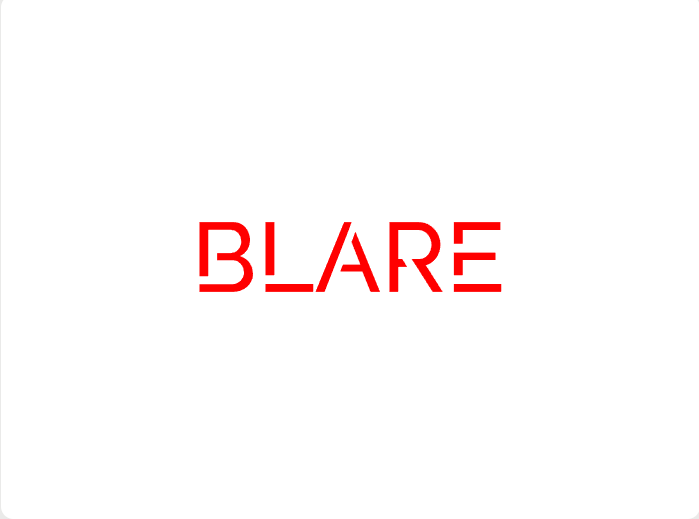

 

## 🚀 Blare – Futuristic Music Player 🌆🎶🎛️

**Blare** is a **futuristic city-themed music player** 🎼🚀 built to **blend music with a high-tech, neon-lit aesthetic** 🌟💡. Inspired by a **sleek, futuristic metropolis** 🏙️, Blare features a **vivid blend of glowing blue, purple, and pink tones** 💙💜, coupled with a **modern, glassmorphic UI design** 🪟✨. It offers **smooth music playback** ▶️ while immersing you in a **visual experience that feels like driving a supercar 🏎️ through a neon-lit city at night** 🌌.

**Blare** also allows you to **switch between two viewing modes**, giving you **flexibility in how you experience your music player**, whether you prefer a **compact interface** or an **immersive display**. 🔄🖥️🎧
## 🚀 How to Run Blare 🏁🎶

- 🔽 **Download the Project Files** to your local system.  
- 📂 **Locate the `index.html` File** in the downloaded folder.  
- 🖱️ **Open `index.html` in Two Ways:**  
  **➤ Option 1:** Right-click on `index.html` and select **"Open with Live Server"** (recommended if using **VS Code**).  
  **➤ Option 2:** Simply **double-click `index.html`**, and click on **"Go Live"**  present at the bottom right corner.  
- 🎶 **Enjoy the Music! :** Once opened, **Blare** will be fully functional, allowing you to enjoy smooth music playback in a **futuristic, neon-lit UI**. 🌆⚡🎵
## 🚀 Tech Stack Used 🛠️💻

**Blare** is built using the following technologies:

- 🖥️ **HTML** – For the structure of the music player.
- 🎨 **CSS** – For styling, animations, and the futuristic theme.
- ⚡ **JavaScript** – For dynamic functionality and smooth user interactions.
- 🪟 **Glassmorphism UI** – A modern **frosted-glass effect** to enhance the futuristic look.
## 🏞️ Screenshots

## 👥 Contributors

Built this project with ❤️ by :-
- Shouvanik Santra &nbsp;[(@Shouvanik21)](https://github.com/Shouvanik21)
## License

[Apache License 2.0 ©️ BLARE](https://github.com/Shouvanik21/Music_player/blob/main/LICENSE)

## 🙏 Support

If you found this project helpful, please ⭐ star the repository on GitHub, 💬 share your feedback, or 🤝 contribute by submitting pull requests. You can also 📣 spread the word by sharing it with others. Your support keeps me motivated to build more amazing projects. Thank you! 🚀❤️